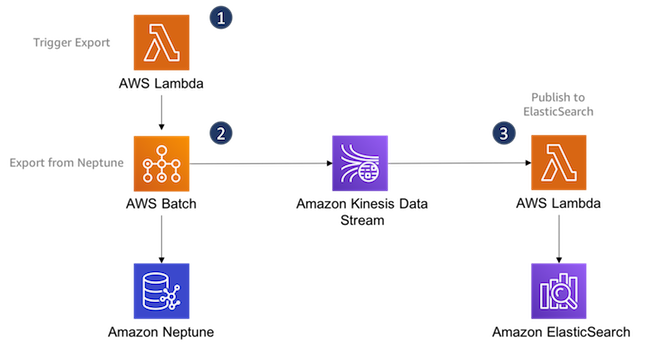

# Export Neptune to Elasticsearch

The [Neptune Full-text Search](https://docs.aws.amazon.com/neptune/latest/userguide/full-text-search-cfn-create.html) CloudFormation templates provide a mechanism for indexing all _new_ data that is added to an Amazon Neptune database in Elasticsearch. However, there are situations in which you may want to index _existing_ data in a Neptune database prior to enabling the full-text search integration.

This solution allows you to index existing data in an Amazon Neptune database in ElasticSearch.

Once you have populated Elasticsearch with your existing Neptune data, you can remove this solution from your account.

## Prerequisites

Before provisioning the solution ensure the following conditions are met:
  
  - You have an existing Neptune cluster and an existing Elasticsearch cluster in the same VPC
  - ElasticSearch is version 7.1 or above
  - You have at least one subnet with a route to the internet:
    - Either, a subnet with the __Auto-assign public IPv4 address__ set to __Yes__, a route table with a route destination of __0.0.0.0/0__, and an internet gateway set to __Target__ (for example, __igw-1a2b3c4d__).
    - Or, a subnet with the __Auto-assign public IPv4 address__ set to __No__, a route table with a route destination of __0.0.0.0/0__, and a NAT gateway set to __Target__ (for example, __nat-12345678901234567__). For more details, see [Routing](https://docs.aws.amazon.com/vpc/latest/userguide/VPC_Scenario2.html#VPC_Scenario2_Routinghttps://docs.aws.amazon.com/vpc/latest/userguide/VPC_Scenario2.html#VPC_Scenario2_Routing).
  - You have VPC security groups that can be used to access your Neptune and Elasticsearch clusters.
    
This solution uses [_neptune-export_](https://github.com/awslabs/amazon-neptune-tools/tree/master/neptune-export) to export data from your Neptune database. We recommend using _neptune-export_ against a static version of your data. Either suspend writes to your database while the export is taking place, or run the export against a [snapshot](https://docs.aws.amazon.com/neptune/latest/userguide/backup-restore-create-snapshot.html) or [clone](https://docs.aws.amazon.com/neptune/latest/userguide/manage-console-cloning.html) of your database.

_neptune-export_ uses long-running queries to generate the metadata and the data files. You may need to increase the __neptune_query_timeout__ [DB parameter](https://docs.aws.amazon.com/neptune/latest/userguide/parameters.html) in order to run the export solution against large datasets.

The export process uses SSL to connect to Neptune. It currently supports IAM Database Authentication for Gremlin, but not SPARQL.
    
## Installation

  1. Launch the [Neptune-to-Elasticsearch CloudFormation stack](https://s3.amazonaws.com/aws-neptune-customer-samples/neptune-sagemaker/cloudformation-templates/export-neptune-to-elasticsearch/export-neptune-to-elasticsearch.json) for your Region from the table below.
  
  2. Once the stack has been provisioned, open a terminal and run the __StartExportCommand__ AWS Command Line Interface (CLI) command from the CloudFormation output. For example:

     ```
     aws lambda invoke \
       --function-name arn:aws:lambda:eu-west-1:000000000000:function:export-neptune-to-kinesis-xxxx \
       --region eu-west-1 \
       /dev/stdout
     ```
     
     The function returns the name and ID of an AWS Batch job that begins the export from Neptune.
     
  3. Once you have successfully populated Elasticsearch with existing data in your Neptune database, you can remove this solution from your account be deleting the CloudFormation stack.
  
| Region | Stack |
| ---- | ---- |
|US East (N. Virginia) |  [](https://us-east-1.console.aws.amazon.com/cloudformation/home?region=us-east-1#/stacks/create/review?templateURL=https://s3.amazonaws.com/aws-neptune-customer-samples/neptune-sagemaker/cloudformation-templates/export-neptune-to-elasticsearch/export-neptune-to-elasticsearch.json&stackName=neptune-index) |
|US East (Ohio) |  [](https://us-east-2.console.aws.amazon.com/cloudformation/home?region=us-east-2#/stacks/create/review?templateURL=https://s3.amazonaws.com/aws-neptune-customer-samples/neptune-sagemaker/cloudformation-templates/export-neptune-to-elasticsearch/export-neptune-to-elasticsearch.json&stackName=neptune-index) |
|US West (Oregon) |  [](https://us-west-2.console.aws.amazon.com/cloudformation/home?region=us-west-2#/stacks/create/review?templateURL=https://s3.amazonaws.com/aws-neptune-customer-samples/neptune-sagemaker/cloudformation-templates/export-neptune-to-elasticsearch/export-neptune-to-elasticsearch.json&stackName=neptune-index) |
|Europe (Ireland) |  [](https://eu-west-1.console.aws.amazon.com/cloudformation/home?region=eu-west-1#/stacks/create/review?templateURL=https://s3.amazonaws.com/aws-neptune-customer-samples/neptune-sagemaker/cloudformation-templates/export-neptune-to-elasticsearch/export-neptune-to-elasticsearch.json&stackName=neptune-index) |
|Europe (London) |  [](https://eu-west-2.console.aws.amazon.com/cloudformation/home?region=eu-west-2#/stacks/create/review?templateURL=https://s3.amazonaws.com/aws-neptune-customer-samples/neptune-sagemaker/cloudformation-templates/export-neptune-to-elasticsearch/export-neptune-to-elasticsearch.json&stackName=neptune-index) |
|Europe (Frankfurt) |  [](https://eu-central-1.console.aws.amazon.com/cloudformation/home?region=eu-central-1#/stacks/create/review?templateURL=https://s3.amazonaws.com/aws-neptune-customer-samples/neptune-sagemaker/cloudformation-templates/export-neptune-to-elasticsearch/export-neptune-to-elasticsearch.json&stackName=neptune-index) |
|Europe (Stockholm) | [](https://eu-north-1.console.aws.amazon.com/cloudformation/home?region=eu-north-1#/stacks/create/review?templateURL=https://s3.amazonaws.com/aws-neptune-customer-samples/neptune-sagemaker/cloudformation-templates/export-neptune-to-elasticsearch/export-neptune-to-elasticsearch.json&stackName=neptune-index) |
|Asia Pacific (Mumbai) | [](https://ap-south-1.console.aws.amazon.com/cloudformation/home?region=ap-south-1#/stacks/create/review?templateURL=https://s3.amazonaws.com/aws-neptune-customer-samples/neptune-sagemaker/cloudformation-templates/export-neptune-to-elasticsearch/export-neptune-to-elasticsearch.json&stackName=neptune-index) |
|Asia Pacific (Seoul) | [](https://ap-northeast-2.console.aws.amazon.com/cloudformation/home?region=ap-northeast-2#/stacks/create/review?templateURL=https://s3.amazonaws.com/aws-neptune-customer-samples/neptune-sagemaker/cloudformation-templates/export-neptune-to-elasticsearch/export-neptune-to-elasticsearch.json&stackName=neptune-index) |
|Asia Pacific (Singapore) | [](https://ap-southeast-1.console.aws.amazon.com/cloudformation/home?region=ap-southeast-1#/stacks/create/review?templateURL=https://s3.amazonaws.com/aws-neptune-customer-samples/neptune-sagemaker/cloudformation-templates/export-neptune-to-elasticsearch/export-neptune-to-elasticsearch.json&stackName=neptune-index) |
|Asia Pacific (Sydney) | [](https://ap-southeast-2.console.aws.amazon.com/cloudformation/home?region=ap-southeast-2#/stacks/create/review?templateURL=https://s3.amazonaws.com/aws-neptune-customer-samples/neptune-sagemaker/cloudformation-templates/export-neptune-to-elasticsearch/export-neptune-to-elasticsearch.json&stackName=neptune-index) |
|Asia Pacific (Tokyo) | [](https://ap-northeast-1.console.aws.amazon.com/cloudformation/home?region=ap-northeast-1#/stacks/create/review?templateURL=https://s3.amazonaws.com/aws-neptune-customer-samples/neptune-sagemaker/cloudformation-templates/export-neptune-to-elasticsearch/export-neptune-to-elasticsearch.json&stackName=neptune-index) |

## Solution overview



  1. You trigger the export process via an AWS Lambda Function
  2. The export process uses AWS Batch to host and execute _neptune-export_, which exports data from Neptune and publishes it to an Amazon Kinesis Data Stream in the [Neptune Streams format](https://docs.aws.amazon.com/neptune/latest/userguide/streams-change-formats.html).
  3. A second AWS Lambda function polls the Kinesis Stream and publishes records to your Amazon Elasticsearch cluster. This function uses the same parsing and publishing code as the Neptune Streams Elasticsearch integration solution.

## Monitoring and troubleshooting

To diagnose issues with the export from Neptune to Kinesis, consult the Amazon CloudWatch logs for your AWS Batch __export-neptune-to-kinesis-job__. These logs will indicate whether _neptune-export_ was successfully downloaded to the batch instance, and the progress of the export job. When reviewing the logs, ensure that:

  - _neptune-export_ has been successfully downloaded to the Batch compute instance
  - _neptune-export_ has successfully exported nodes and relationships from Neptune and published them to Kinesis

To diagnose issues with the indexing of data in Amazon Elasticsearch, consult the Amazon CloudWatch logs for your __kinesis-to-elasticsearch__ AWS Lambda function. These logs will show the Lambda connecting to Elasticsearch, and will indicate how many records from the Kinesis Stream have been processed.


